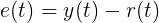
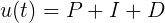
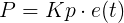
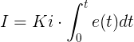
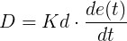
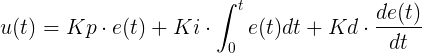
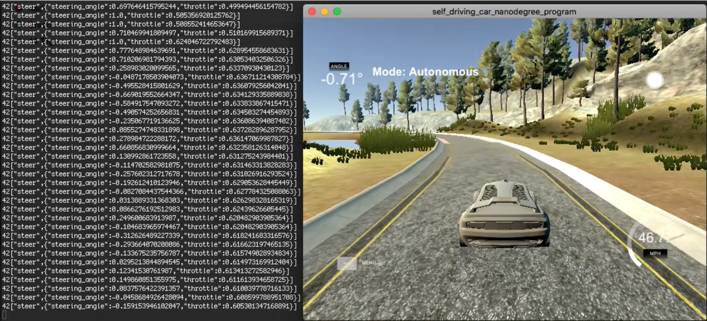

# PID Controller for Autonomous Cars
### Overview:
Assuming an autonomous car has accurately perceived its environment with cameras, LIDAR, RADAR, GPS, or other sensors, the problem remains of what it should do with that information. The problem is twofold. What path should it take? And, how should it behave to follow that path? In this project, the problem is simplified because the track in the Udacity simulator is a single lane road with turns that ultimately forms a large loop. Therefore, the car's best path is stay in the center of the lane. In a first attempt to achieve this, I will implement a proportional-integral-derivative (PID) controller to control the steering angle of the car. 

The contents of this repository include:
```
root
|   .gitignore
|   CMakeLists.txt
|   CODEOWNERS
|   README.md
|   cmakepatch.txt
|   install-mac.sh
|   install-ubuntu.sh
|   project_assignment.md
|
|___readme_images
|   |   
|   |   ...
|   
|___src
    |   main.cpp
    |   PID.h
    |   PID.cpp
    |   json.hpp
```

Everything in the root directory, except for this README, was provided by Udacity to install the necessary dependencies. CODEOWNERS is the citation of the author of the starter code. The readme_images directory contains the images in this README. main.cpp connects to the simulator using WebSocketIO and makes the necessary calls to the PID class. PID.cpp contains my implementation of the PID controller as well as a simple solution I devised for controlling the throttle and brakes of an autonomous vehicle.

### PID Controller:
Given a desired set point SP=r(t) and a process variable PV=y(t), I can measure an error term at every time step e(t) as the diffence between them. 
 
 <figure>
  
</figure>
 <p></p>
 
The PID controller minimizes e(t) by updating a control variable u(t) at each time step. For example, if the SP is the center of the lane, then e(t) is the distance of the car from the lane center or its cross-track error (CTE). By updating u(t) or the steering angle at each time step, the PID controller will minimize the CTE. As its name suggests, there are three terms to this update, proportional (P), integral (I), and derivative (D), so that:
 
 <figure>
  
</figure>
 <p></p>
 
 The proportional term is the product of the CTE and a parameter that must be tuned, the P-gain (Kp).
 
 <figure>
  
</figure>
 <p></p>
 
 The integral term is the product of the integral of the CTE over time and a parameter, the I-gain (Ki).
 
 <figure>
  
</figure>
 <p></p>
 
 The derivative term is the product of the derivative of the CTE with respect to time or its rate of change and a parameter, the D-gain (Kd).
 
 <figure>
  
</figure>
 <p></p>
 Putting this together, we get:
  <figure>
  
</figure>
 <p></p>
 
It is assumed that for this project, all the gain values are negative. For my implementation, see PID.cpp lines 54-79.

### Tuning the Gain Parameters:
I used the twiddle algorithm (PID.cpp lines 128-188) to tune the gain parameters. Although twiddle was good at suggesting which parameters needed to be increased or decreased, it often got stuck at local minima. So I would run twiddle for several iterations, each parameter change running for 5,000 steps or approximately one loop around the track. Once the parameters reached local minima, I would manually tune, using my intuition, then go back to twiddle, initializing my parameters with my current best set, until my PID controller effectively minimized the CTE to keep the car safely on the road. 

To tune manually, I used my intuition about what each term does. The P term adjusts the steering angle to turn more sharply towards the center as the CTE grows larger. Since the car must turn to reach the center, once the CTE is zero, the car is not parallel with the imaginary line depicting the ideal path, so the car overshoots, causing the CTE to accumlate in the opposite direction. Therefore, a P controller without the I or D terms would cause the car to oscillate around the lane center. An example of when to increase Kp is if the car drives off-road because it is not turning enough on sharp curves.

The D term is introduced to combat this osciallition. If the car is on the right side of the lane and turning too sharply toward the center (i.e., the steering angle is a large negative value), then the D term will produce a positive value as opposed to the negative value produced by the P term, ideally smoothing that sharp turn. An example of when to increase Kd is if the car osicallates too much. Kd might need to be decreased if the steering angle is bouncing back and forth drastically or if the car is unable to quickly recenter when it veers off course.

The I term is introduced to ensure that the controller does not favor one side of the road over the other. For example, this could happen if the car's wheels are not alligned so it naturally drifts to the left or right. If most of the time the car is driving close to the lane center or if it regularly osciallates about the lane center, the I term will be 0 or close to it.

### Throttle Control:
At each time step, not only does the car need to know by how much to turn, but it also needs to know by how much to brake or accelerate. I chose a relatively simple solution that keeps the car between 40-50mph for most of the track. I use a series of if-else statements that determines how much to speed up or slow down based on the car's current speed and CTE. The farther away from the lane center the car is, the less throttle it applies. Therefore, on straight runs, where the PID controller is good at keeping the car in the center of the lane, more throttle is applied. On sharp turns, where the PID controller commonly underturns then overturns to compensate, less throttle or perhaps even braking is applied, so the car slows, allowing it to more quickly recenter. Although this solution is not the most sophisticated, it is simple and works well with the PID controller. See PID.cpp lines 81-118.

### Results:
 <figure>
  <a href="https://www.youtube.com/watch?v=9eERXKn2QGY">
  
</figure>
</a>
 <p></p>
 
Click on the above picture to see the first minute of my results. Recording the screen slows the controller's interactions with the simulator, so running it without recording improves the results. Nonetheless, the PID controller works fairly well. See how the car keeps drifting slightly to the right on the first straight section before recentering. That is because the road is not completely straight. An obvious shortcoming of PID controllers is that, whenever there the road curves, the controller underturns. PID controllers are not designed to anticipate how conditions might change in the future. Not a bad start, but I think we might need something more sophisticated...
